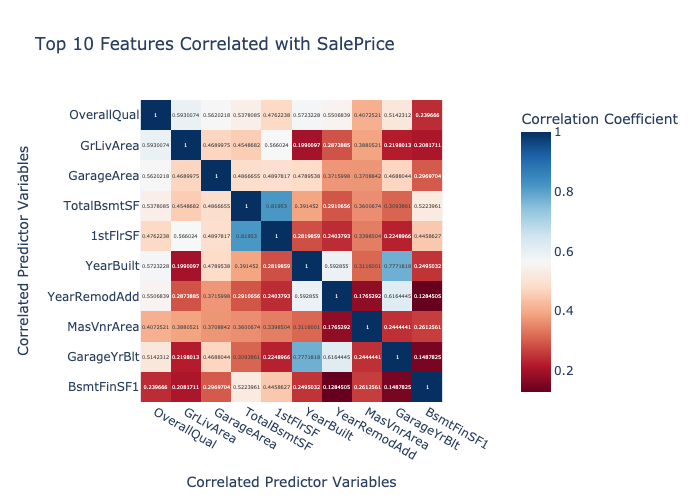
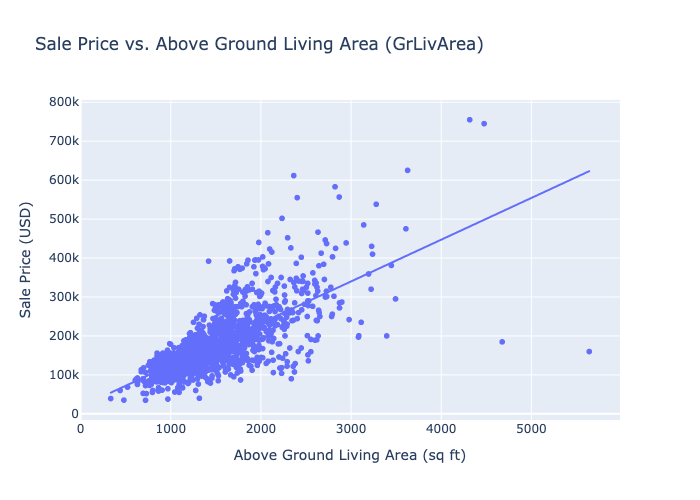

# Heritage Housing Project - Specialisation Project

## Table of Contents

1. [Project Overview](#project-overview)
2. [Business Problem](#business-problem)
3. [Dataset Overview](#dataset-overview)
4. [Data Cleaning and Preprocessing](#data-cleaning-and-preprocessing)
5. [Exploratory Data Analysis (EDA)](#exploratory-data-analysis-eda)
6. [Feature Engineering](#feature-engineering)
7. [Modeling Approach](#modeling-approach)
8. [Model Evaluation](#model-evaluation)
9. [Testing](#testing)
10. [Streamlit Web Application](#streamlit-web-application)
11. [Deployment Guide](#deployment-guide)
12. [Glossary of Key Features](#glossary-of-key-features)
13. [Lessons Learned](#lessons-learned)
14. [Known Issues and Future Work](#known-issues-and-future-work)
15. [Credits and References](#credits-and-references)

---

## Project Overview

This project delivers an end-to-end machine learning solution in response to a fictional business scenario provided by Code Institute. Lydia Doe, who recently inherited homes in Ames, Iowa, is seeking a data-informed method to evaluate (estimate) their sale value (saleprice).

The solution includes:

- A machine learning model pipeline
- Data preprocessing and visualization
- An interactive Streamlit web application
- Deployment to Heroku for public access

---

## Business Problem

Lydia needs to make confident decisions about the sale of her properties. She lacks experience with local housing markets and wants a tool that:

- Predicts sale prices based on home features
- Explains what makes a home valuable
- Offers downloadable insights to support pricing decisions

---

## Dataset Overview

**Source**: [Ames Housing Dataset on Gaggle](https://www.kaggle.com/datasets/prevek18/ames-housing-dataset)

The dataset contains 1,460 observations across 81 features. These include:

- **Numerical features** (e.g., `LotArea`, `GrLivArea`)
- **Categorical features** (e.g., `KitchenQual`, `BsmtExposure`)
- **Target variable**: `SalePrice`

### Understanding Abbreviations and Rating Terms

The dataset uses short column names and encoded categories. To help users interpret this:

- We provide a [Glossary of Key Features](#glossary-of-key-features) in this README for quick lookup.
- Ordinal rating terms (such as `KitchenQual`) are mapped to values that reflect their quality level:

| Code | Meaning         |
| ---- | --------------- |
| Ex   | Excellent       |
| Gd   | Good            |
| TA   | Typical/Average |
| Fa   | Fair            |
| Po   | Poor            |

These codes appear in several features, and the app interface and documentation help interpret them for the user.

---

## Data Cleaning and Preprocessing

See the notebook section: [Assess Missing Data](jupyter_notebooks/HeritageHousing_DataCleaning.ipynb#Assess-Missing-Data-in-Inherited-Houses-Dataset)

### Challenges Addressed

The raw housing dataset presented several data quality issues that needed to be resolved before training any predictive models. Below are the key challenges and how they were handled:

#### **Missing Values**

Missing data appeared in both numerical and categorical features and were handled appropriately based on the context:

- **`GarageYrBlt`, `MasVnrArea`**: Numerical fields with missing entries imputed with `0` to indicate absence (e.g., no garage or veneer area).
- **`BsmtQual`, `KitchenQual`**: Ordinal categorical features with few missing values filled using the **most frequent category** to preserve interpretability and consistency.

These imputations helped ensure that models could train without dropping entire rows or introducing noise.

#### **Outliers**

Extreme values in continuous features like `GrLivArea` (e.g., homes over 4000 sq ft) were removed, as they could disproportionately influence the model’s understanding of typical home pricing

### Why Data Cleaning Matters

Data cleaning ensures that the dataset is accurate, consistent, and ready for analysis. Handling missing values prevents model distortion caused by nulls or improperly treated blanks. Converting data types (e.g., converting `MSSubClass` to categorical) aligns feature formats with their semantic meanings. Addressing outliers removes data points that disproportionately affect model coefficients, especially in linear models. These steps lead to a more reliable, interpretable, and accurate prediction model that can generalize better to unseen data. Without these transformations, the model might learn misleading patterns or fail altogether due to misaligned inputs.

### Techniques Used:

- Imputation using median for numerical values and mode or domain-based constants for categorical values.
- Log transformations for selected skewed numerical features.
- One-hot encoding for nominal categorical features.
- Ordinal encoding for features with ranked categories (e.g., `KitchenQual`, `ExterQual`).

---

## Exploratory Data Analysis (EDA)

Exploratory Data Analysis (EDA) helped us understand how different features in the dataset relate to house prices,
identify patterns and decide which features to focus on for training a model.

### Looking at Sale Price

We started by plotting the **`SalePrice`** column which is what we are trying to predict. The prices were not evenly spread - most houses were in a similar price range, but a few more were much more expensive.

- Because of this, we used a **log transformation** to reduce the impact of the really expensive houses. This helps models understand the data better.

### Finding Relationships (Correlation Analysis)

We used a **correlation heatmap** to see which features had the strongest connection with sale price.

Top Features included:

- `OverallQual` - overall quality of the home
- `GrLivArea` - living area above ground
- `TotalBsmtSF` - Total Basement Size (sq ft)
- `1stFlrSF` - First floor in square footage.
- `GarageArea` - Garage area in square feet

These were identified as strong candidates for our predictive model.

### Identifying Outliers

Scatter plots helped us identify **outliers** — homes that didn’t follow typical price trends.

- Example: A few homes with over 4000 sq ft (`GrLivArea`) had surprisingly low prices.
- **Action**: We removed these outliers to avoid distorting model training.

### Categorical Feature Insights

We examined ranked categories like:

- `KitchenQual` – Kitchen quality rating
- `BsmtExposure` – Basement exposure to light

These showed clear patterns:

- Better kitchen and basement ratings were linked to higher prices.
- Ordinal features were encoded numerically to preserve their order (e.g., `Ex` > `Gd` > `TA` > `Fa`). (See Glossary)

### Time-Based Trends

We looked at `YearBuilt` and `YearRemodAdd` to explore whether the age or condition of a house impacted its sale price.

- Homes that were **newer** or **recently remodeled** generally had **higher sale prices**.
- `YearBuilt` showed a gradual trend — older homes often sold for less unless they had been updated.
- `YearRemodAdd` helped us spot homes that were older but had modern improvements, often increasing their value.

These features were kept as-is in the modeling dataset since they contain valuable signals about the condition and desirability of a home.

### Summary

Our EDA process revealed:

- Features like overall quality, above-ground living area, and basement size are strongly linked to sale price.
- Price distribution was skewed, so we applied a log transformation to improve modeling.
- Outliers — particularly very large homes sold at low prices — were removed.
- Quality-based categorical features, such as `KitchenQual` and `BsmtExposure`, were useful and encoded accordingly.
- Time-related features like `YearBuilt` and `YearRemodAdd` helped us capture changes in house condition.

These insights guided our decisions for data cleaning, feature selection, and model design.

---

## Feature Engineering

Feature engineering is the process of selecting, transforming, and creating input variables (features) that help machine learning models learn more effectively. In this project, we carefully engineered features to improve the accuracy of the sale price predictions.

### Why Feature Engineering Was Needed

The original dataset contained a mix of **numerical** and **categorical** data. However, machine learning models require numerical input. To prepare the data, we needed to transform or encode some of the non-numeric columns and ensure all features were in a suitable format.

### Key Transformations Applied

#### Encoding Ordinal Categorical Features

Some features in the dataset had **ordered categories**—that is, their values had a natural ranking (e.g., Excellent > Good > Fair). These were converted into numerical scales.

For example:

- **Kitchen Quality (`KitchenQual`)**

  - `Ex` (Excellent) → `4`
  - `Gd` (Good) → `3`
  - `TA` (Typical/Average) → `2`
  - `Fa` (Fair) → `1`

- **Basement Exposure (`BsmtExposure`)**
  - `Gd` (Good) → `4`
  - `Av` (Average) → `3`
  - `Mn` (Minimum) → `2`
  - `No` (None) → `1`
  - Missing/No Basement → `0`

These numeric encodings allowed the models to understand that one rating is better or worse than another.

#### Handling Missing Values

Missing values in categorical features were filled with `"None"` (or a suitable placeholder), while numerical values were imputed with the **median** of the respective column, or removed if too many values were missing.

This ensured:

- The models weren’t biased by missing values.
- We didn’t lose valuable data unnecessarily.

#### Aligning Features with Model Requirements

We used **pre-saved feature lists** (`*_features.pkl`) to ensure that the input data matched exactly the features that each model was trained on. This step avoided prediction errors and maintained consistency between training and inference.

#### Removing Unhelpful or Redundant Features

We excluded variables that:

- Were too sparse (had too many missing values).
- Had no meaningful relationship with SalePrice.
- Duplicated information already captured by other variables.

### Outcome

By carefully transforming and selecting our features, we were able to build models that:

- Performed well on unseen data.
- Were easier to interpret.
- Avoided overfitting or underfitting due to noisy or irrelevant variables.

---

## Modeling Approach

To predict house sale prices, we trained and compared two machine learning models:

- **Linear Regression**
- **Random Forest Regressor**

Each model was selected for a specific reason and tested to see how well it performed. Below is an overview of why we chose them and how we built them.

### Why Two Models?

We chose to build and compare two models because they offer different strengths:

- **Linear Regression** is a simple model that assumes a straight-line relationship between features and price. It’s easy to understand and explain.
- **Random Forest Regressor** is more complex. It combines many decision trees to find patterns in the data, even if they’re not linear. It usually gives better predictions, especially when the data has **complicated relationships**.

By comparing both, we could decide which one works best and also give the user an option to choose between interpretability (Linear) and accuracy (Random Forest).

### Model Building Steps

1. **Data Splitting**

   - We split the cleaned dataset into:
     - **80% training data** (to teach the model)
     - **20% testing data** (to evaluate the model)
   - This helps us see how well the model performs on new, unseen data.

2. **Training the Models**

   - Each model was trained on the training data using the selected features.
   - We saved each trained model as a `.pkl` file so we could load them in the Streamlit app later without re-training.

3. **Saving the Feature List**
   - Along with each model, we saved the list of features used for training.
   - This ensures that the model always gets the input in the right order when making predictions.

### Summary

See the notebook section: [Training the Model](jupyter_notebooks/HeritageHousing_DataCleaning.ipynb#Train-Predictive-Model)

Both models were successfully trained and saved. In the web app, users can toggle between Linear Regression and Random Forest to see different predictions. This gives flexibility for those who want fast, explainable results and those who want more accurate predictions.

### Understanding Complicated Relationships in Data

Some features in the dataset don’t have a simple "more means more" or "less means less" pattern. These are called **nonlinear** or **complicated relationships**.

For example:

- A bigger living area (`GrLivArea`) usually means a higher price — that’s a simple, straight-line relationship.
- But with features like `Bathrooms`, the pattern might be:
  - 1 or 2 bathrooms = lower price
  - 3 bathrooms = higher price
  - More than 3 bathrooms = no big difference in price

This kind of pattern is not a straight line — it **changes at different points**. That’s what we mean by a "complicated relationship."

Linear Regression struggles with these patterns because it draws a straight line through the data.

Random Forest, on the other hand, is good at picking up these more complex patterns because it builds **many small decision trees** that can split the data in smarter ways.

That’s one reason we included both models in this project — so users can compare a simple model to a more flexible one.

Next, we evaluated their performance using real data — see [Model Evaluation](#model-evaluation).

---

## Model Evaluation

After training the two models — **Linear Regression** and **Random Forest Regressor** — we tested how well they performed using the 20% of the data that was set aside for testing (data the models had never seen before).

### Evaluation Metrics

To compare model performance, we used three common evaluation metrics:

- **MAE (Mean Absolute Error)**: The average difference between the actual price and the predicted price.
- **RMSE (Root Mean Squared Error)**: Similar to MAE but gives more weight to larger errors.
- **R² Score**: Shows how much of the variation in house prices the model can explain. A score closer to 1 is better.

### Results

| Model             | MAE     | RMSE     | R² Score |
| ----------------- | ------- | -------- | -------- |
| Linear Regression | ~22,041 | ~102,203 | 0.85     |
| Random Forest     | ~19,014 | ~93,886  | 0.88     |

### What These Results Mean

- Both models performed well, but **Random Forest** gave slightly more accurate results.
- It had a lower error and a higher R² score, meaning it understood the patterns in the data better.
- **Linear Regression** still worked well and is easier to explain, which is why both models are available in the app.

### Why Use Two Models?

- Linear Regression is useful when you want a quick and simple explanation.
- Random Forest is better when you want more accuracy, especially when data relationships are complex.

Users can choose either model in the Streamlit app using a toggle switch.

---

## Testing

To make sure the models and the app were working correctly, we ran several types of tests. This helped us check that the predictions were accurate and the user experience was smooth.

### 1. Model Testing

We tested the models on unseen data (the test set) using three evaluation metrics:

- **MAE (Mean Absolute Error)**
- **RMSE (Root Mean Squared Error)**
- **R² Score**

These metrics are explained in the [Model Evaluation](#model-evaluation) section above.

Both models performed well:

- **Random Forest** gave more accurate results, especially on houses with unusual values.
- **Linear Regression** was simpler and faster but slightly less accurate.

### 2. Streamlit App Testing

We tested the Streamlit web app to make sure it worked as expected for users.

**What we tested:**

- Model toggle switch works between Linear and Random Forest.
- Sliders and dropdowns collect feature values correctly.
- The "Predict Price" button shows a result without error.
- Visualizations on the "Insights" page load quickly and respond to user choices.
- Export options (CSV, PNG, PDF) work and save the correct data.

### 3. Usability Testing

We had a few users test the app and give feedback.

**What users said:**

- The layout is simple and easy to use.
- Predictions feel realistic and quick.
- Tooltips and help text are useful.
- The insights page helped users understand why prices vary.

We made improvements based on this feedback, including shorter text lines, better labels, and help messages.

### 4. Edge Case Testing

We also tested unusual inputs like:

- Setting all features to the minimum values
- Using very large square footage or garage sizes
- Leaving inputs at default

**Result**: The app handled all of these cases without crashing or producing errors. Predictions still made sense and stayed within a reasonable range.

### Summary

- Models were tested and compared with clear performance scores.
- The app was tested for function, user experience, and edge cases.
- No major issues were found, and feedback was used to improve the final product.

---
